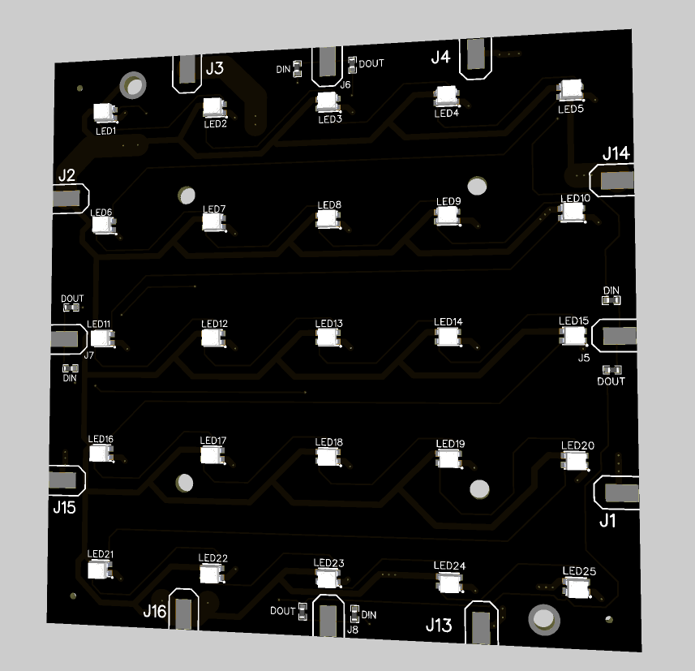
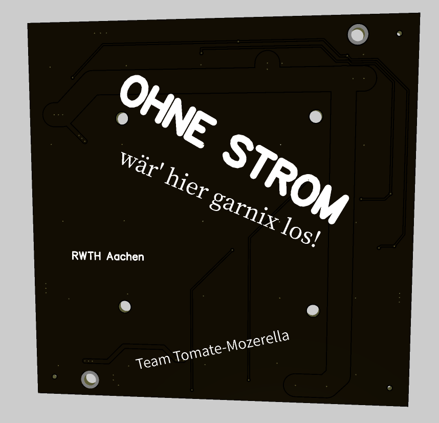

# ET-Lions Display

abstract
--------
While the Maschis build non working rockets out of shopping karts,
ETis build flashy working LED matricies.

This won't help our inferior players win anything but at least we look cool while losing.

hardware design
---------------
To keep production both cheap and light in manual labor, the display is
split up into 100mm*100mm PCBs that are relatively cheap to manufacture.
We used JLCPCB for this effort as they are by far the cheapest on the market and broke
students don't have money for pcbway. We also used their assembly services to put the
5 * 5 LEDs per board onto the boards by pick&place.. otherwise we would have had to
solder 1250 LEDs by hand..

The general layout of the PCB is very modular, there are power lines that connect
the 5V and Ground of all PCBs and Data in/ outputs on all 4 sides that make it easy
to route the signal wherever it needs to go.

Of course the back also got some nice silkscreen.. we can't forget what this display is for!

As this massive amount of LEDs is going to need quite a bit of power, we opted to
use either electric tool batteries (Parkside 18V series) or an ebike battery (36V).
Either way there will be a few DC/DC Buck converters wired to one DC Input that spread
the high voltage power to different parts of the board.

Holding everything together will hopefully be a rather thin but not bendy plate of wood,
which all the PCBs will be screwed into.

More of the Hardware design will be added when it's actually done ;)

software design
---------------

the microcontroller of choice for driving these kinds of led matricies is the esp32.
we are programming it in the Arduino IDE for simplicity. Libraries used will be the
FastLED library with some tricks to support parallel output for increased framerate.

The data layout and how we are going to put the pictures onto the matrix on the fly
are coming soon..